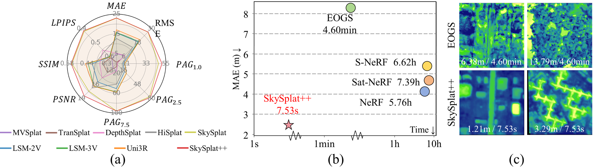

# SkySplat Series


Thank you for your attention to and interest in the **SkySplat** series of papers.  
The **complete codebase** will be open-sourced **after the extended version of the paper is accepted**.  

**Before that**, we plan to gradually release the generalizable 3D Gaussian Splatting (3DGS) methods for **sprase-view satellite imagery**, including:  

- **MVSplat** (refined version)  
- **HiSplat** (refined version)  

Project webpage: [SkySplatV2](https://nancheng2001.github.io/SkySplatV2/)

---

## ✨ Highlights

**SkySplat++** extends our previous method **SkySplat**, refining Gaussian representations in a coarse-to-fine manner to capture both large-scale structures and fine textures.  
It demonstrates superior performance in sparse-view 3D reconstruction, as illustrated below:

<p align="center">

</p>

- **Coarse-to-fine Gaussian refinement** for robust large-scale structure and detailed textures  
- **High efficiency** in reconstructing DSMs from sparse satellite imagery  
- **Generalizable 3DGS framework** suitable for multi-temporal and multi-view data  

---

## 📝 To Do List

- Release **MVSplat** code for sparse-view satellite imagery  
- Release **HiSplat** code for sparse-view satellite imagery  

---

## 💳 Citation

If your work uses all or part of this code, please cite:
```
@inproceedings{huang2026skysplat,
  title={SkySplat: Generalizable 3D Gaussian splatting from multi-temporal sparse satellite images},
  author={Huang, Xuejun and Liu, Xinyi and Wan, Yi and Zheng, Zhi and Zhang, Bin and Xiong, Mingtao and Pei, Yingying and Zhang, Yongjun},
  booktitle={Proceedings of the AAAI Conference on Artificial Intelligence},
  volume={40},
  number={7},
  pages={5158--5166},
  year={2026}
}
```

You can find our [paper on AAAI2026 and arxiv 📄](https://ojs.aaai.org/index.php/AAAI/article/view/37430).
